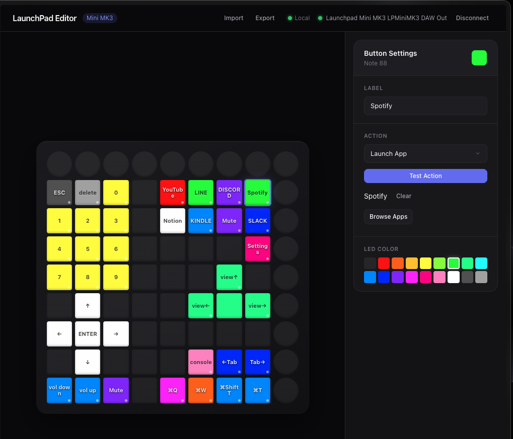

# Launchpad Editor

Novation Launchpad Mini MK3 用のウェブベース設定エディタです。ブラウザから MIDI コントローラーの各ボタンにアクション・LED カラーを割り当て、自分だけのランチパッドを構築できます。



## 主な機能

- **MIDI デバイス接続** - Web MIDI API を使い、Launchpad Mini MK3 を自動検出・接続
- **9x9 グリッドエディタ** - 81 個のボタンを視覚的に設定。ドラッグ＆ドロップで配置の入れ替えも可能
- **アクション設定** - ボタンごとに以下のアクションを割り当て可能：
  - キーボードショートカット（修飾キー + 任意のキー）
  - アプリ起動（macOS のアプリ一覧から選択）
  - URL を開く
  - シェルコマンド実行
- **LED カラー設定** - 18 種類のプリセットカラーまたはカスタム RGB で各ボタンの色を設定
- **設定の保存・読み込み** - ローカルストレージに自動保存。JSON 形式でのインポート/エクスポートにも対応
- **テスト実行** - 保存前にアクションの動作を確認可能

## 技術スタック

- **Next.js 16** / **React 19** / **TypeScript 5**
- **Tailwind CSS 4**
- **Web MIDI API**

## セットアップ

### ローカル開発

```bash
npm install
npm run dev
```

[http://localhost:3456](http://localhost:3456) をブラウザで開いてください。
ローカルではすべてのアクションがそのまま動作します。

### Vercel デプロイ + コンパニオンサーバー

Vercel にデプロイすると UI はどこからでもアクセスできますが、キーボードショートカット・アプリ起動・コマンド実行はローカル PC で実行する必要があります。そのため**コンパニオンサーバー**をローカルで常駐させます。

#### 初回セットアップ（1回だけ）

```bash
npm run companion:install
```

これで macOS のログイン時にコンパニオンサーバー（`localhost:19191`）が自動起動します。クラッシュしても自動復帰します。

#### アンインストール

```bash
npm run companion:uninstall
```

#### 手動で起動する場合

```bash
npm run companion
```

#### コンパニオンの動作

| アクション | コンパニオンなし | コンパニオンあり |
|---|---|---|
| URL を開く | 動く（ブラウザで直接開く） | 動く |
| キーボードショートカット | 動かない | 動く |
| アプリ起動 | 動かない | 動く |
| コマンド実行 | 動かない | 動く |

ヘッダーのステータス表示で接続状態を確認できます:
- **Local**（緑）: コンパニオン接続中 — 全機能が使えます
- **Local offline**（灰）: コンパニオン未起動 — URL を開くのみ動作

## 使い方

1. Launchpad Mini MK3 を USB で接続
2. ブラウザで「Connect」ボタンをクリック
3. グリッド上のボタンを選択し、右パネルでアクション・カラーを設定
4. 設定は自動的にローカルストレージに保存されます

## API エンドポイント

| エンドポイント | メソッド | 説明 |
|---|---|---|
| `/api/config` | GET / POST | 設定の読み込み・保存 |
| `/api/apps` | GET | インストール済み macOS アプリ一覧の取得 |
| `/api/execute` | POST | アクションの実行（ショートカット・アプリ起動・URL・コマンド） |

## プロジェクト構成

```
src/
├── app/
│   ├── page.tsx              # メインエディタ UI
│   ├── layout.tsx            # ルートレイアウト
│   ├── globals.css           # グローバルスタイル
│   └── api/                  # API ルート
├── components/
│   ├── LaunchpadGrid.tsx     # 9x9 ボタングリッド
│   └── ActionEditor.tsx      # アクション・カラー設定パネル
├── hooks/
│   ├── useLaunchpad.ts       # MIDI 接続・制御フック
│   └── useCompanion.ts       # コンパニオンサーバー接続状態フック
└── lib/
    ├── types.ts              # 型定義
    ├── colors.ts             # カラーパレット・変換
    └── companion.ts          # コンパニオンサーバー通信ユーティリティ
companion/
├── server.mjs                # コンパニオンサーバー本体（Node.js 組み込みモジュールのみ）
├── install-launchagent.sh    # macOS 自動起動インストール
└── uninstall-launchagent.sh  # macOS 自動起動アンインストール
```
